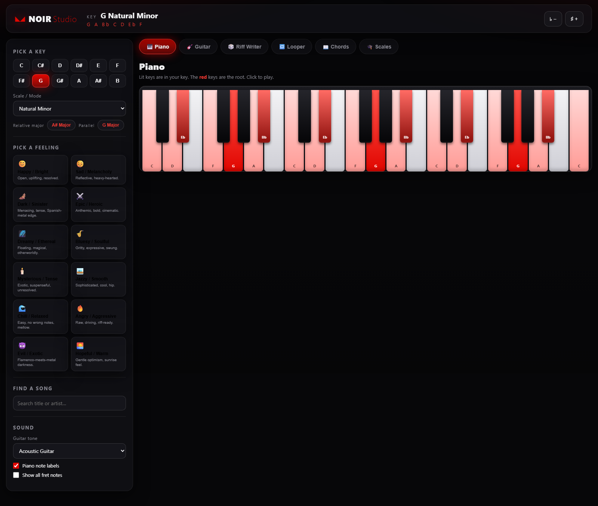

# 🦇 NOIR Studio

A sleek, **Batman-Noir** (black · crimson · white, frosted "Apple Glass") music companion for **piano & guitar**. Pick a **key**, a **feeling**, or a **song**, and it shows you exactly where the notes live — so you can stop hunting and start writing.



## What it does

| Feature | Where | Notes |
|---|---|---|
| **Pick a Key** | Key Lab (left) | 12 roots × 13 scales/modes. Header shows the spelled notes (e.g. `G A Bb C D Eb F`). |
| **Pick a Feeling** | Key Lab | 12 vibes (Happy, Dark, Dreamy, Bluesy, Evil…) each mapped to a fitting scale + root. |
| **Find a Song** | Key Lab | 91-song database — search by title/artist, it sets the key it's played in. |
| **Relative minor / major** | Key Lab | One tap to flip to the relative (and parallel) key. |
| **🎹 Piano** | Tab | Multi-octave keyboard, scale notes lit, **root in red**. Click to play. |
| **🎸 Guitar** | Tab | Fretboard with every scale note on every string. **10 tunings** + fully custom per-string tuning (note + octave). |
| **🎲 Random Riff Writer** | Tab | Generates musical riffs from your key (weighted random walk that resolves to the root). Tempo + length sliders, play, loop, and **send to the Looper**. |
| **🔁 Looper** | Tab | Record a take on piano/guitar, then **overdub layered loops** in sync. Bars, tempo, quantize, metronome, per-track mute/delete. |
| **📖 Chord Book** | Tab | Real **chord diagrams** (SVG) for every root — Major / Minor / 7th — plus the diatonic chords in your current key. Tap any chord to hear it strummed. |
| **🎓 Learn Scales** | Tab | Every scale's step pattern, degrees, and a "play scale" button that lights up the instrument. |
| **Transpose** | Header | ♭− / ♯+ to nudge the whole key by a semitone. |

## Sound

Uses **real recorded samples** (not cheap MIDI), loaded on demand from free, well-licensed libraries via CDN:

- **Piano** — [Salamander Grand Piano](https://github.com/tambien/Piano) (a sampled Yamaha C5), served from `tonejs.github.io/audio/salamander/` — MIT.
- **Acoustic + Electric Guitar** — [nbrosowsky/tonejs-instruments](https://github.com/nbrosowsky/tonejs-instruments) (public-domain sourced samples, cleaned & normalized), served via the jsDelivr CDN.
- Played through [**Tone.js**](https://tonejs.github.io/) with a touch of reverb and a limiter so it sounds warm, not harsh.

If the CDN is ever unreachable, the app automatically falls back to a built-in synth so it always makes sound.

> **Internet is needed on first load** to fetch the samples and Tone.js (you chose CDN streaming). After that the browser caches them. Want it fully offline? See "Bundling samples" below.

## Run it

It's a static site — no build step.

```bash
cd C:\Users\DBT65\APP0110\noir-studio
python -m http.server 8777
```

Then open **http://localhost:8777** in Chrome, Edge, or Safari.

> Use a local server (above) rather than double-clicking `index.html` — browsers gate audio + cross-origin samples more strictly on `file://`.
> Audio starts on your **first click** (browser autoplay policy) — you'll see a quick "Loading samples…" the first time.

## Project layout

```
noir-studio/
├── index.html         # structure
├── css/styles.css     # Batman-Noir glass theme
└── js/
    ├── theory.js      # music-theory engine (scales, spelling, chords, relative keys)
    ├── data.js        # songs, feelings, tunings
    ├── audio.js       # Tone.js sampler wrapper (piano + guitars, synth fallback)
    ├── piano.js       # piano keyboard view
    ├── guitar.js      # fretboard view + tunings
    ├── chords.js      # picture chord book (generated SVG diagrams)
    ├── scales.js      # learn-scales view
    ├── riff.js        # Random Riff Writer
    ├── looper.js      # multi-track loop recorder (Tone.Transport)
    └── app.js         # controller: state, Key Lab, tabs, wiring
```

## Ideas / next steps

- **Bundle samples** for full offline use (download the Salamander + guitar sample folders into `samples/` and point `audio.js` at them).
- Export Looper takes to `.wav` (via `Tone.Recorder`).
- Save/share a key or loop via URL.
- Add more songs, alternate tunings, and chord voicings.
- Wrap as a desktop app (Tauri/Electron) for a dock icon.
